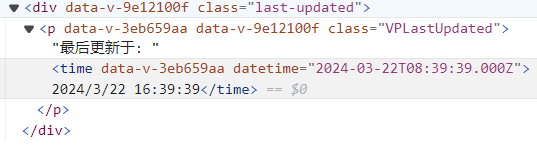
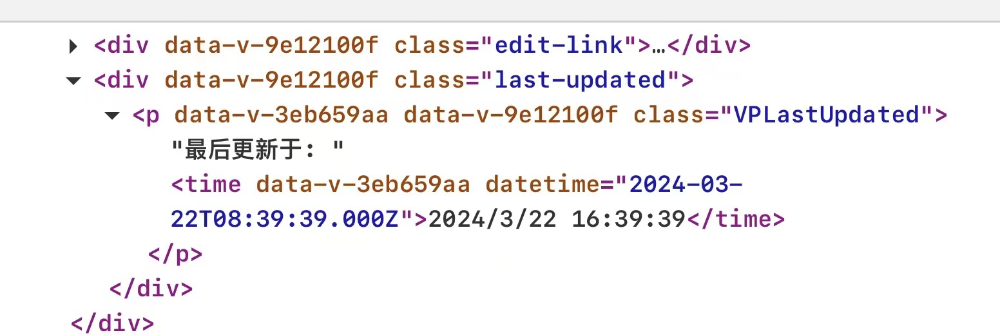
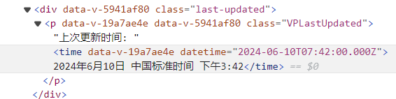
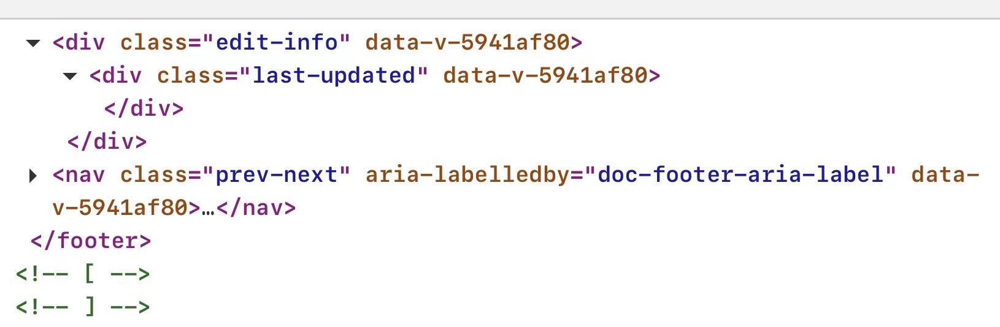

# LastUpdated在Safari上不显示

<https://github.com/vuejs/vitepress/issues/3974>

## https://vitepress.dev/

### Microsoft edge



### Safari



## My Website

### Microsoft edge



### Safari



## Additional context

```ts
lastUpdated: {
    text: '上次更新时间',
    formatOptions: {
    localeMatcher: "best fit",
    weekday: undefined,
    era: undefined,
    year: "numeric",
    month: "long",
    day: "numeric",
    hour: "numeric",
    minute: "numeric",
    second: undefined,
    timeZoneName: "longGeneric",
    formatMatcher: "best fit",
    hour12: true,
    timeZone: "Asia/Chongqing"
    }
},
```